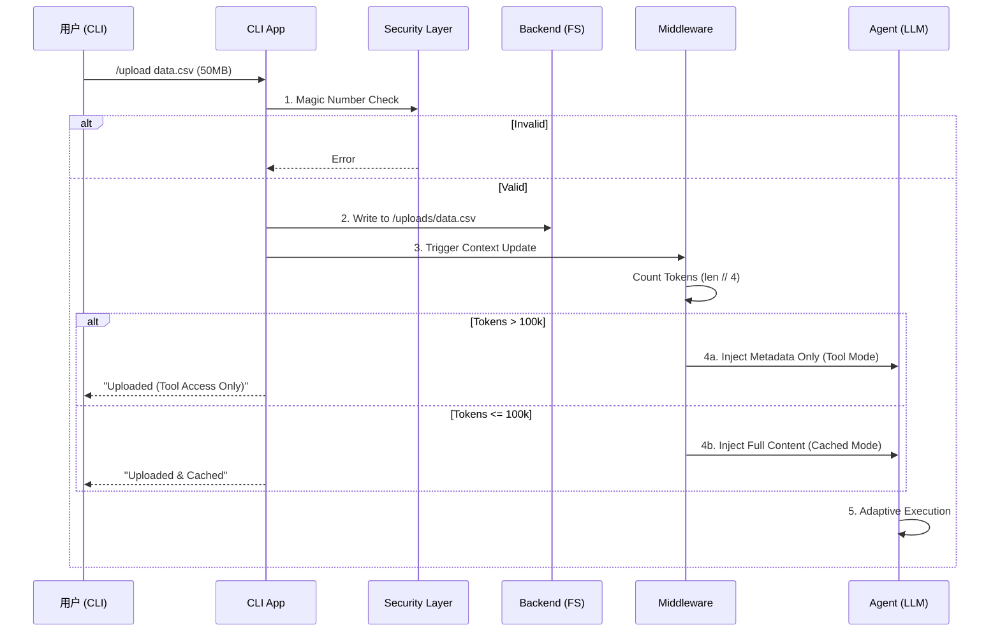

# Deep Agents 附件上传与多模态支持实施方案 (v3.0 - Adaptive Context Strategy)

> **Status**: Implemented (2026-02-26)
> **PR**: N/A (Direct Commit)

## 1. 概述 (Overview)

本方案旨在为 Deep Agents 引入企业级、自适应的附件上传与多模态处理能力。

基于对 **Claude Code** (Context Caching) 和 **Manus AI** (File-based Memory) 的深度调研，以及对 **Token Overflow (上下文溢出)** 风险的深刻洞察，本方案采用 **"Adaptive Context Strategy" (自适应上下文策略)**。

该策略融合了 v2.1 的速度优势与 v2.0 的扩展能力，通过智能判断文件规模，动态选择 **全文缓存 (Full Context Caching)** 或 **工具探索 (Tool-based Exploration)** 模式，实现对“任意规模”文件的优雅处理。

## 2. 核心理念 (Core Philosophy)

我们摒弃单一的处理模式，转而根据**信息价值密度**和**模型承载能力**进行动态路由：

| 文件规模 | 处理模式 | 核心机制 | 用户体验 |
| :--- | :--- | :--- | :--- |
| **小/中文件** (< 100k Tokens) | **Cached Context** | Prompt Caching | **秒级全知**，Agent 倒背如流 |
| **超大文件** (> 100k Tokens) | **Tool Access** | Agentic Reading (AREL) | **研究员模式**，Agent 自主检索 |

**核心优势**：
1.  **直击痛点**: 彻底解决 v2.1 方案在面对 50MB 日志文件时导致的 API 报错与崩溃问题。
2.  **无缝降级**: 无论文件大小，Agent 均能从容应对，对用户透明。
3.  **成本最优**: 仅缓存高价值核心文档，避免将低价值海量数据塞入昂贵的 Context。

## 3. 架构设计 (Architecture)

### 3.1 自适应注入逻辑 (Adaptive Injection Logic)

Middleware 层引入 **Token Counter** (安全气囊)，根据文件 Token 数量决定注入策略：

*   **Case A: Cached Injection (< 100k Tokens)**
    *   直接将文件内容封装在 `<file_context>` 中。
    *   注入 System Prompt 并标记为 `ephemeral` 缓存。
    *   **效果**: Agent 立即获得全知视角。

*   **Case B: Metadata Injection (> 100k Tokens)**
    *   仅注入 `<file_metadata>` (路径、大小、类型)。
    *   追加 System Instruction: *"File is too large for full context. Use `grep` or `read_file` to access content."*
    *   **效果**: Agent 知道文件存在，但需要通过工具去“读”。

### 3.2 数据流向 (Data Flow)



## 4. 详细实施步骤 (Detailed Implementation)

### 4.1 第一阶段：CLI 与安全 (Frontend)

**目标**: 提供稳健的文件入口与反馈机制。

*   **CLI Command**:
    *   实现 `/upload <path>`。
    *   放宽文件大小限制至 **100MB** (以支持 PDF/图片及 Tool Access 模式)。
    *   **User Feedback**: 根据 Middleware 返回的处理模式，向用户显示不同的状态提示（"Cached" vs "Tool Access Only"）。
*   **Security Layer**:
    *   保留 `puremagic` 校验，拦截恶意二进制文件。

### 4.2 第二阶段：后端与工具链 (Backend & Tools)

**目标**: 确保 Tool Access 模式下的工具健壮性。

*   **BackendProtocol**:
    *   **FilesystemBackend**: 确保 `upload_files` 逻辑稳定。
*   **Tool Hardening**:
    *   **`grep`**: 确保在 Windows 环境下的可用性（Deep Agents 需内置 Python 实现的 grep 逻辑，不依赖系统命令）。
    *   **`read_file`**: 确保支持大文件的 `offset` / `limit` 读取，防止内存溢出。

### 4.3 第三阶段：中间件与自适应逻辑 (Middleware)

**目标**: 实现智能路由与 Token 计数。

*   **AttachmentMiddleware** (或扩展 `FilesystemMiddleware`):
    *   **Token Counter**: 实现 `estimate_tokens(text)` 方法。
        *   策略: 优先使用 `tiktoken` (若可用)，否则使用保守估算 `len(text) // 3` (适配中文场景)。
    *   **XML Generator**:
        *   动态生成 `<uploaded_files>` 块。
        *   根据 Token 计数选择填充 `content` 还是仅填充 `metadata`。
    *   **Prompt Caching**: 确保生成的 XML 块位于 System Prompt 的静态缓存区。

## 5. 关键细节补充 (Implementation Details)

### 5.1 Token 估算策略
为了平衡性能与准确性，建议采用分级策略：
```python
def estimate_tokens(text: str) -> int:
    # 1. 尝试使用 tiktoken (最准)
    try:
        import tiktoken
        enc = tiktoken.get_encoding("cl100k_base")
        return len(enc.encode(text))
    except ImportError:
        # 2. 保守估算 (中文场景优化)
        # 英文 ~4 chars/token, 中文 ~0.7 chars/token
        # 混合环境下取 len // 3 较为安全
        return len(text) // 3
```

### 5.2 System Instruction 注入
对于进入 **Tool Access** 模式的文件，必须显式告知 Agent：
```xml
<file path="/uploads/server.log" size="50MB" status="tool_access_only">
    [SYSTEM NOTICE]
    This file exceeds the context limit. Content is NOT loaded.
    You MUST use tools to access it:
    - Use `ls` to check file existence.
    - Use `grep` to search for keywords (e.g., error codes).
    - Use `read_file` with line limits to read specific sections.
</file>
```

## 6. 验收标准 (Verification)

1.  **Token 安全**:
    *   上传 50MB 日志文件，系统不报错，自动降级为 Tool Mode。
2.  **缓存命中**:
    *   上传 100KB 代码文件，第二轮对话 Token 费用显著降低。
3.  **工具可用性**:
    *   在 Windows 环境下，Agent 能成功对大文件执行 `grep` 搜索。
4.  **用户感知**:
    *   CLI 能准确反馈文件是被“缓存”了还是仅“上传”了。

## 7. 扩展性规划 (Future Roadmap)

*   **多模态增强**: 针对 PDF/图片，后续可引入 Vision 模型处理逻辑，同样遵循 Token/Size 阈值判断。
*   **MCP Server**: 这一层抽象完全兼容 MCP，未来可直接将 `/uploads` 暴露为 MCP Resource。
